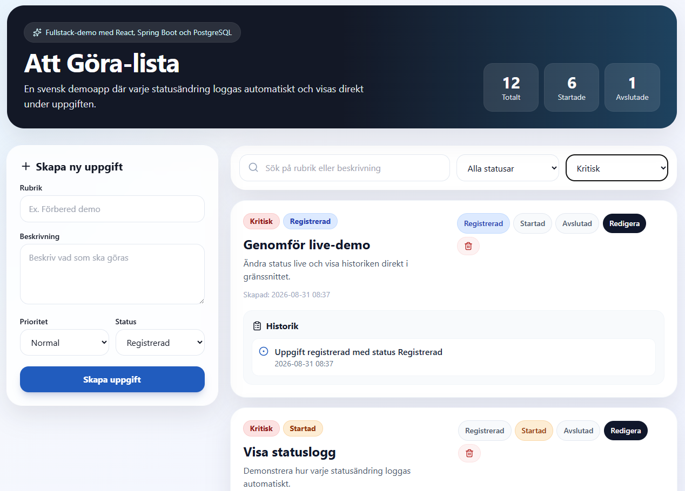

# Att Göra-lista

En modern fullstack-applikation för hantering av uppgifter med komplett statushistorik.



Applikationen är byggd för att demonstrera en produktionsnära lösning med React, Spring Boot och PostgreSQL samt visa hur AI-assisterad utveckling kan användas för att accelerera utvecklingen av moderna system.

---

# Teknikstack

## Backend

- Java 21
- Spring Boot 3
- Spring Data JPA
- Spring Validation
- PostgreSQL
- Swagger/OpenAPI
- Lombok
- Maven
- JUnit 5
- Mockito

## Frontend

- React
- Vite
- TypeScript
- Axios
- Tailwind CSS

## Infrastruktur

- Docker
- Docker Compose

---

# Funktioner

## Uppgifter

Varje uppgift innehåller:

- Rubrik
- Beskrivning
- Prioritet
- Status
- Skapad datum/tid
- Historik

## Prioriteter

| Prioritet | Färg |
|------------|------------|
| Låg | Grå |
| Normal | Blå |
| Hög | Orange |
| Kritisk | Röd |

## Status

| Status | Färg |
|------------|------------|
| Registrerad | Blå |
| Startad | Orange |
| Avslutad | Grön |

---

# Statushistorik

Varje statusändring loggas automatiskt.

Exempel:

```text
2026-08-19 09:30
Status ändrad från Registrerad till Startad

2026-08-19 11:45
Status ändrad från Startad till Avslutad
```

Historiken:

- Sparas i databasen
- Visas direkt under respektive uppgift
- Sorteras med senaste händelsen först
- Uppdateras automatiskt vid statusändring

---

# Grafisk design

Designen är inspirerad av:

- Microsoft Fluent Design
- Moderna dashboards
- Combitech-inspirerade färger

UI innehåller:

- Avrundade hörn
- Diskreta skuggor
- Responsiv layout
- Sömlösa statusindikatorer
- Färgkodning efter status och prioritet

---

# API

## Hämta alla uppgifter

```http
GET /api/todos
```

## Hämta en uppgift

```http
GET /api/todos/{id}
```

## Skapa uppgift

```http
POST /api/todos
```

Exempel:

```json
{
  "title": "Förbered demo",
  "description": "Skapa wow-effekt",
  "priority": "KRITISK",
  "status": "REGISTRERAD"
}
```

---

## Uppdatera uppgift

```http
PUT /api/todos/{id}
```

---

## Ändra status

```http
PATCH /api/todos/{id}/status
```

Exempel:

```json
{
  "status": "STARTAD"
}
```

Tillåtna värden:

```text
REGISTRERAD
STARTAD
AVSLUTAD
```

---

## Ta bort uppgift

```http
DELETE /api/todos/{id}
```

---

# Swagger

Swagger UI används för att demonstrera och testa API:t.

Swagger finns på:

```text
http://localhost:8080/swagger-ui.html
```

Swagger kan användas för att:

- Skapa uppgifter
- Ändra status
- Verifiera API-funktionalitet
- Demonstrera backend live

---

# Exempeldata

Vid uppstart skapas automatiskt:

- Minst 10 uppgifter
- Historikposter
- Exempel på statusförändringar

Exempeldata används för att förenkla demonstrationer.

---

# Starta lokalt med Docker

## Bygg och starta hela lösningen

```bash
docker compose up --build
```

---

## Stoppa lösningen

```bash
docker compose down
```

---

## Bygg om från grunden

```bash
docker compose down

docker compose build --no-cache

docker compose up
```

---

# Åtkomst

## Frontend

Standard:

```text
http://localhost:3000
```

Alternativ port:

```text
http://localhost:3001
```

eller:

```text
http://localhost:13000
```

---

## Backend

```text
http://localhost:8080
```

---

## Swagger

```text
http://localhost:8080/swagger-ui.html
```

---

## PostgreSQL

Standard:

```text
localhost:5432
```

Alternativ:

```text
localhost:15432
```

---

# Databasmodell

## todo_item

Innehåller:

```text
id
title
description
priority
status
created_at
```

---

## todo_status_history

Innehåller:

```text
id
todo_item_id
from_status
to_status
changed_at
message
```

---

# Tester

Backend innehåller:

## Service-tester

Verifierar:

- Skapande av uppgift
- Historikskapande
- Statusändringar

## Controller-tester

Verifierar:

- REST API
- JSON-respons
- HTTP-statuskoder

Kör tester:

```bash
cd backend

mvn test
```

---

# Kända problem och lösningar

## Problem: PostgreSQL-port 5432 används redan

Fel:

```text
Bind for 0.0.0.0:5432 failed: port is already allocated
```

Orsak:

En annan PostgreSQL-instans eller Docker-container använder porten.

Kontrollera:

```bash
docker ps
```

eller:

```powershell
netstat -ano | findstr :5432
```

Lösning:

```yaml
postgres:
  ports:
    - "15432:5432"
```

Starta därefter om:

```bash
docker compose down

docker compose up --build
```

---

## Problem: Frontend-port 3000 används redan

Fel:

```text
Bind for 0.0.0.0:3000 failed: port is already allocated
```

Orsak:

En annan webbserver använder port 3000.

Exempel:

```text
nginx
React-devserver
annan Docker-container
```

Kontrollera:

```bash
docker ps
```

Lösning:

```yaml
frontend:
  ports:
    - "3001:80"
```

eller:

```yaml
frontend:
  ports:
    - "13000:80"
```

Frontend nås därefter via:

```text
http://localhost:3001
```

---

## Problem: TypeScript-build misslyckas

Fel:

```text
Option 'moduleResolution=node10' has been removed
```

Lösning:

Uppdatera `tsconfig.json`:

```json
{
  "compilerOptions": {
    "target": "ES2020",
    "module": "ESNext",
    "moduleResolution": "bundler",
    "jsx": "react-jsx",
    "strict": true,
    "skipLibCheck": true,
    "noEmit": true
  }
}
```

---

## Problem: React-typer saknas

Fel:

```text
Could not find a declaration file for module 'react/jsx-runtime'
```

Lösning:

Installera:

```json
{
  "devDependencies": {
    "@types/react": "^18.3.5",
    "@types/react-dom": "^18.3.0"
  }
}
```

Kör sedan:

```bash
npm install
```

---

## Problem: LazyInitializationException

Fel:

```text
PersistentBag
```

eller:

```text
LazyInitializationException
```

Orsak:

Historik hämtas efter att Hibernate-sessionen stängts.

Lösning:

Använd:

```java
@EntityGraph(attributePaths = "history")
List<TodoItem> findAll();
```

och:

```java
@EntityGraph(attributePaths = "history")
Optional<TodoItem> findById(Long id);
```

i repository.

Exempel:

```java
public interface TodoRepository extends JpaRepository<TodoItem, Long> {

    @Override
    @EntityGraph(attributePaths = "history")
    List<TodoItem> findAll();

    @Override
    @EntityGraph(attributePaths = "history")
    Optional<TodoItem> findById(Long id);
}
```

---

## Problem: Swagger öppnas inte

Kontrollera:

```bash
docker ps
```

Backend-logg:

```bash
docker logs todo-backend
```

Verifiera:

```text
http://localhost:8080/swagger-ui.html
```

---

## Problem: Frontend kommunicerar inte med backend

Testa:

```text
http://localhost:8080/api/todos
```

Om JSON-data returneras fungerar backend.

Kontrollera därefter frontendens API-url:

```typescript
const api = axios.create({
  baseURL: "http://localhost:8080/api"
});
```

---

# Verifiering efter installation

Kontrollera att följande fungerar:

✅ PostgreSQL startar

✅ Backend startar

✅ Frontend startar

✅ Swagger fungerar

✅ GET /api/todos returnerar data

✅ PATCH /api/todos/{id}/status fungerar

✅ Historik uppdateras

✅ CRUD fungerar

✅ Docker Compose startar samtliga containrar

---

# Demo-checklista

Innan presentation:

```bash
docker compose up --build
```

Verifiera:

✅ Frontend öppnas

✅ Swagger öppnas

✅ Exempeldata visas

✅ Skapa ny uppgift fungerar

✅ Ändra status fungerar

✅ Historik uppdateras

✅ Filtrering fungerar

✅ Sökning fungerar

✅ API fungerar från Swagger

---

# Demo-scenario (10 minuter)

## Del 1 – Visa applikationen

1. Öppna frontend
2. Visa existerande uppgifter
3. Visa prioriteringar
4. Visa statusindikatorer
5. Visa historik

---

## Del 2 – Skapa en ny uppgift

Skapa:

```text
Rubrik:
Förbered AI-demo

Beskrivning:
Demonstrera Copilot och Docker

Prioritet:
Kritisk

Status:
Registrerad
```

Spara.

Visa att den dyker upp direkt.

---

## Del 3 – Ändra status

Ändra:

```text
Registrerad
↓
Startad
```

Visa historiken.

Ändra därefter:

```text
Startad
↓
Avslutad
```

Visa att en ny rad skapats.

---

## Del 4 – Visa API

Öppna Swagger:

```text
http://localhost:8080/swagger-ui.html
```

Kör:

```http
PATCH /api/todos/1/status
```

Body:

```json
{
  "status": "STARTAD"
}
```

Kör därefter:

```http
GET /api/todos/1
```

Visa den nya historikposten.

---

## Del 5 – Visa fullstackkedjan

```text
React
↓
Axios
↓
Spring Boot
↓
JPA
↓
PostgreSQL
↓
Historik sparas
↓
UI uppdateras
```

---

# AI-genererad lösning

Denna lösning genererades initialt med hjälp av AI-assisterad utveckling (Microsoft Copilot / GitHub Copilot) och verifierades därefter genom manuell testning, felsökning och förbättringar.

Syftet är att demonstrera hur AI kan accelerera utvecklingen av moderna fullstack-applikationer samtidigt som traditionell systemutvecklingskompetens fortfarande behövs för kvalitetssäkring, felsökning och produktionsanpassning.